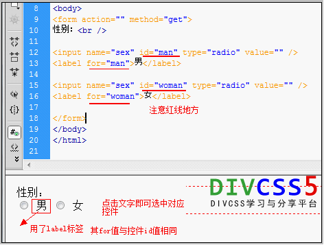

# TaskOne

<!--
create time: 2016-03-16 16:49:29
Author: <TODO: 请写上你的名字>

This file is created by Marboo<http://marboo.io> template file $MARBOO_HOME/.media/starts/default.md
本文件由 Marboo<http://marboo.io> 模板文件 $MARBOO_HOME/.media/starts/default.md 创建
-->

# Baidu IFE 前端第一阶段任务一

## 完成过程中遇到的一些问题
### 1. 中文编码出现乱码
通过在```<head></head>```中插入```<meta charset="utf-8"```即可，如下

``` html
	<head>
		<meta charset="utf-8">
	</head>
```

### 2. 很长的一段文字中如何使其分段
``` html
<p>
	这是一个很长很长的段落, 这是一个很长很长的段落, 这是一个很长很长的段落, 这是一个很长很长的段落, 这是一个很长很长的段落, 这是一个很长很长的段落, 这是一个很长很长的段落, 换行了
</p>
```
上面这一段代码的显示效果如下：

<p>
	这是一个很长很长的段落, 这是一个很长很长的段落, 这是一个很长很长的段落, 换行了, 这是一个很长很长的段落, 这是一个很长很长的段落, 这是一个很长很长的段落, 这是一个很长很长的段落
</p>

发现在```换行了```这个词出现时，文本并没有断开。你可以使用```<br>```或者```<br/>```来使其强制换行。代码如下：

``` html
<p>
	这是一个很长很长的段落, 这是一个很长很长的段落, 这是一个很长很长的段落, 换行了,<br>这是一个很长很长的段落, 这是一个很长很长的段落, 这是一个很长很长的段落, 这是一个很长很长的段落
</p>
```

<p>
	这是一个很长很长的段落, 这是一个很长很长的段落, 这是一个很长很长的段落, 换行了,<br>这是一个很长很长的段落, 这是一个很长很长的段落, 这是一个很长很长的段落, 这是一个很长很长的段落
</p>

### 3.```<figcaption>```标签的使用
想要出现如下的效果，即让图片带上标签```山本美月prpr```

<div align = center>
	<figure>
		<figcaption>山本美月prpr</figcaption>
		
	</figure>
</div>

源代码如下，其中```<div align = center></div>```起到的作用是使图片居中的作用。
``` <figcaption>山本美月prpr</figcaption> ```用作文档中插图的图像，带有一个标题：

``` html
<div align = center>
	<figure>
		<figcaption>山本美月prpr</figcaption>
		
	</figure>
</div>
```

### 4. ```<div>,<section>,<article>,<aside>```的使用
在Html5中，加入了很多用于**布局**的标签，他们有```<header>```、```<nav>```、```<section>```、```<article>```、```<aside>```、```<footer>```、```<hgroup>```等等。


article是一个特殊的section标签，它比section具有更明确的语义, 它代表一个独立的、完整的相关内容块。  

div、section、article，语义是从无到有，逐渐增强的。div无任何语义，仅仅用作样式化或者脚本化的标签，对于一段主题性的内容，则就适用section，而假如这段内容可以脱离上下文，作为完整的独立存在的一段内容，则就适用 article。  

原则上来说，能使用article的时候，也是可以使用section的，但是实际上，假如使用article更合适，那么就不要使用section。

#### html5中的语义元素
##### 什么是语义元素?

一个语义元素能够清楚的描述其意义给浏览器和开发者。
***无语义*** 元素实例: ```<div>``` 和 ```<span>``` - 无需考虑内容.
***语义***元素实例: ```<form>```, ```<table>```, and `````` - 清楚的定义了它的内容.
许多现有网站都包含以下HTML代码： ```<div id="nav">```, ```<div class="header">```, 或者 ```<div id="footer">```, 来指明导航链接, 头部, 以及尾部.
HTML5提供了新的语义元素来明确一个Web页面的不同部分:


### 5. ```&nbsp;```的使用
```&nbsp; ```表示空格


### 6. ```placeholder```与```value```的区别
```<input type="email" placeholdler="半透明">```的显示效果估下
<input type="email" placeholdler="半透明"><br/>
而```<input type="email" value="不透明">```的显示效果估下
<input type="email" value="不透明">

### 6.5 input的属性

<table border="1">
<tbody>
<tr>
<th align="left" width="22%">属性</th>
<th align="left" width="37%">值</th>
<th align="left" width="41%">描述</th>
</tr>
<tr>
<td><a href="att-input-accept.html">accept</a></td>
<td>audio/*

video/*

image/*
<i>MIME_type</i></td>
<td>规定通过文件上传来提交的文件的类型。
(只针对type="file")</td>
</tr>
<tr>
<td><a href="att-input-align.html">align</a></td>
<td>left

right

top

middle

bottom</td>
<td><span class="deprecated">HTML5已废弃，不赞成使用。规定图像输入的对齐方式。 (只针对type="image")</td>
</tr>
<tr>
<td><a href="att-input-alt.html">alt</a></td>
<td><i>text</i></td>
<td>定义图像输入的替代文本。 (只针对type="image")</td>
</tr>
<tr>
<td class="style1"><a href="att-input-autocomplete.html">autocomplete</a><span class="new">New</span></td>
<td>on

off</td>
<td>autocomplete 属性规定 &lt;input&gt; 元素输入字段是否应该启用自动完成功能。</td>
</tr>
<tr>
<td><a href="att-input-autofocus.html">autofocus</a><span class="new">New</span></td>
<td>autofocus</td>
<td>属性规定当页面加载时 &lt;input&gt;  元素应该自动获得焦点。</td>
</tr>
<tr>
<td><a href="att-input-checked.html">checked</a></td>
<td>checked</td>
<td>checked 属性规定在页面加载时应该被预先选定的  &lt;input&gt; 元素。 (只针对 type="checkbox" 或者 type="radio")</td>
</tr>
<tr>
<td><a href="att-input-disabled.html">disabled</a></td>
<td>disabled</td>
<td>disabled 属性规定应该禁用的 &lt;input&gt; 元素。</td>
</tr>
<tr>
<td><a href="att-input-form.html">form</a><span class="new">New</span></td>
<td><i>form_id</i></td>
<td>form 属性规定 &lt;input&gt; 元素所属的一个或多个表单。</td>
</tr>
<tr>
<td><a href="att-input-formaction.html">formaction</a><span class="new">New</span></td>
<td><i>URL</i></td>
<td>属性规定当表单提交时处理输入控件的文件的 URL。(只针对 type="submit" 和 type="image")</td>
</tr>
<tr>
<td><a href="att-input-formenctype.html">formenctype</a><span class="new">New</span></td>
<td>application/x-www-form-urlencoded

multipart/form-data

text/plain</td>
<td>属性规定当表单数据提交到服务器时如何编码(只适合 type="submit" 和 type="image")。</td>
</tr>
<tr>
<td><a href="att-input-formmethod.html">formmethod</a><span class="new">New</span></td>
<td>get
post</td>
<td>定义发送表单数据到 action URL 的 HTTP 方法。 (只适合 type="submit" 和 type="image")</td>
</tr>
<tr>
<td><a href="att-input-formnovalidate.html">formnovalidate</a><span class="new">New</span></td>
<td>formnovalidate</td>
<td>formnovalidate 属性覆盖 &lt;form&gt; 元素的 novalidate 属性。</td>
</tr>
<tr>
<td><a href="att-input-formtarget.html">formtarget</a><span class="new">New</span></td>
<td>_blank

_self

_parent

_top
<em>framename</em></td>
<td>规定表示提交表单后在哪里显示接收到响应的名称或关键词。(只适合 type="submit" 和 type="image")</td>
</tr>
<tr>
<td><a href="att-input-height.html">height</a><span class="new">New</span></td>
<td><i>pixels</i></td>
<td>规定  &lt;input&gt;元素的高度。(只针对type="image")</td>
</tr>
<tr>
<td><a href="att-input-list.html">list</a><span class="new">New</span></td>
<td><i>datalist_id</i></td>
<td>属性引用  &lt;datalist&gt; 元素，其中包含 &lt;input&gt; 元素的预定义选项。</td>
</tr>
<tr>
<td><a href="att-input-max.html">max</a><span class="new">New</span></td>
<td><i>number

date</i></td>
<td>属性规定 &lt;input&gt; 元素的最大值。</td>
</tr>
<tr>
<td><a href="att-input-maxlength.html">maxlength</a></td>
<td><i>number</i></td>
<td>属性规定 &lt;input&gt; 元素中允许的最大字符数。 </td>
</tr>
<tr>
<td><a href="att-input-min.html">min</a><span class="new">New</span></td>
<td><i>number

date</i></td>
<td>属性规定 &lt;input&gt;元素的最小值。</td>
</tr>
<tr>
<td><a href="att-input-multiple.html">multiple</a><span class="new">New</span></td>
<td>multiple</td>
<td>属性规定允许用户输入到 &lt;input&gt; 元素的多个值。</td>
</tr>
<tr>
<td><a href="att-input-name.html">name</a></td>
<td><i>text</i></td>
<td>name 属性规定 &lt;input&gt; 元素的名称。 </td>
</tr>
<tr>
<td><a href="att-input-pattern.html">pattern</a><span class="new">New</span></td>
<td><em>regexp</em></td>
<td>pattern 属性规定用于验证 &lt;input&gt; 元素的值的正则表达式。</td>
</tr>
<tr>
<td><a href="att-input-placeholder.html">placeholder</a><span class="new">New</span></td>
<td><i>text</i></td>
<td>placeholder 属性规定可描述输入 &lt;input&gt; 字段预期值的简短的提示信息
。</td>
</tr>
<tr>
<td><a href="att-input-readonly.html">readonly</a></td>
<td>readonly</td>
<td>readonly 属性规定输入字段是只读的。</td>
</tr>
<tr>
<td><a href="att-input-required.html">required</a><span class="new">New</span></td>
<td>required</td>
<td>属性规定必需在提交表单之前填写输入字段。</td>
</tr>
<tr>
<td><a href="att-input-size.html">size</a></td>
<td><i>number</i></td>
<td>size 属性规定以字符数计的  &lt;input&gt; 元素的可见宽度。 </td>
</tr>
<tr>
<td><a href="att-input-src.html">src</a></td>
<td><i>URL</i></td>
<td>src 属性规定显示为提交按钮的图像的 URL。 (只针对
type="image")</td>
</tr>
<tr>
<td><a href="att-input-step.html">step</a><span class="new">New</span></td>
<td><i>number</i></td>
<td>step 属性规定 &lt;input&gt; 元素的合法数字间隔。</td>
</tr>
<tr>
<td><a href="att-input-type.html">type</a></td>
<td>button
<br>
checkbox
<br>
color
<br>
date
<br>
datetime
<br>
datetime-local
<br>
email
<br>
file
<br>
hidden
<br>
image
<br>
month
<br>
number
<br>
password
<br>
radio
<br>
range
<br>
reset
<br>
search
<br>
submit
<br>
tel
<br>
text
<br>
time
<br>
url
<br>
week</td>
<td>type 属性规定要显示的  &lt;input&gt; 元素的类型。 </td>
</tr>
<tr>
<td><a href="att-input-value.html">value</a></td>
<td><i>text</i></td>
<td>Specifies the value of an &lt;input&gt; element<b>

</b></td>
</tr>
<tr>
<td><a href="att-input-width.html">width</a><span class="new">New</span></td>
<td><i>pixels</i></td>
<td>value 属性规定  &lt;input&gt; 元素的值。  (只针对type="image")</td>
</tr>
</tbody>
</table>


### 7. ```<nav>```标签
<nav>标签定义导航链接。语义化标签，可读性高，方便封装与维护，实际显示效果有和没有是一样的。

``` html
	<nav>
        <ul>
            <li><a href="#">导航链接一</a></li>
            <li><a href="#">导航链接二</a></li>
            <li><a href="#">导航链接三</a></li>
            <li><a href="#">导航链接四</a></li>
        </ul>
    </nav>
```

其效果为：
<nav>
	<ul>
		<li><a href="#">导航链接一</a></li>
        <li><a href="#">导航链接二</a></li>
        <li><a href="#">导航链接三</a></li>
        <li><a href="#">导航链接四</a></li>
    </ul>
</nav>

### 8. ```<label for=xxx>```的使用
点击```<label>```标签文字时，实现对应控件被选择，需要对应表单控件id的值与label标签内的for值相同。

<input type="radio" checked="checked" name="sex" value="male" id="male"><label for="male">男</label>
<input type="radio" name="sex" value="female" id="female"><label for="female">女</label>




